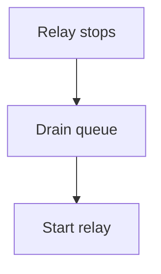

# Restart the relay

The arrow below is the whole point of this fixture. Every diagram in the
estate uses `-->`, so a render hook that escapes its input breaks all of them
at once and none of them loudly.



A highlighted fence, so the build-time highlighter has something to do:

```sql
SELECT count(*) FROM relay_events WHERE state = 'stopped';
```

And a fence in a language nothing knows, which must render as plain text
rather than failing the build:

```notalanguage
this is not a language and that is fine
```

See also the [decision that chose this](../decisions/0001-pick-a-thing.md).
